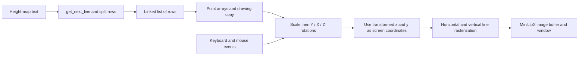

# FdF

This project was completed as part of the École 42 / School 21 curriculum.
It implements a C wireframe viewer for height-map files using MiniLibX.

## Goal

Read a grid of elevations, turn each value into a 3D point, and draw connections
between adjacent points in an interactive window. The existing
[project subject](docs/subject.pdf) describes the FDF landscape-wireframe assignment;
[subject provenance](docs/subject-source.md) records its source and checksum.

## Requirements

### Software

- macOS with the Xcode Command Line Tools (`clang`, `make`, and `ar`).
- The retained MiniLibX and X11 libraries under `includes/X11/`.
- An XQuartz installation providing `/opt/X11/lib/` and an available X11 display
  for execution. An installer/version is **Not documented in the original
  repository**; system installation was not performed during this cleanup.

The supplied graphics binaries target Intel macOS. The Makefile also links the
AppKit framework, so this checkout is not a verified Linux or native Apple Silicon
build. Third-party libraries, documentation, and attribution remain in place.

### Build

From the repository root:

```sh
make -C fdf CC='clang -arch x86_64'
```

This command compiled all project sources, rebuilt `libft.a`, and linked the
executable on the cleanup host. The small build fixes add the existing MiniLibX
header path and honor the selected compiler in both Makefiles. No renderer source
was changed. A plain `make -C fdf` uses the host's default architecture; select
x86_64 explicitly when using the supplied Intel graphics archives.

```sh
make -C fdf clean   # remove project/get_next_line/libft objects
make -C fdf fclean  # also remove the executable and generated libft archive
```

The original build always recompiles the project. The libft target has limited
source dependency tracking; use `fclean` before changing compiler architecture or
rebuilding after libft source edits.

### Running

From the repository root, after building and arranging a compatible X11 display:

```sh
./fdf/fdf fdf/test_maps/42.fdf
```

Apple Silicon execution additionally requires an environment that can run the
Intel executable. That graphical configuration has not been verified here.
The actual map launch failed before application execution because
`/opt/X11/lib/libX11.6.dylib` was absent. Compilation success does not establish
working rendering or controls.

### Testing

There is no automated test suite in this subproject. `test_maps/` contains 15 input
maps, not pass/fail tests. [Validation notes](docs/VALIDATION.md) distinguish the
successful compilation from the blocked GUI attempt and record known source risks.

## Implementation

### Data Flow



### Map and Coordinate Representation

`read_from_the_file.c` reads space-separated height values with `get_next_line`
and `ft_strsplit`, temporarily stores rows in a linked list, and allocates point
arrays. An optional token suffix such as `3,0xFF0000` supplies a hexadecimal color.
The parser forms `x = 3 * column`, `y = 3 * row`, and `z = 2 * height` using the
constants in `fdf.h`.

`rotation.c` applies horizontal/height scaling and rotations around Y, X, and Z.
`draw_the_line.c` rasterizes edges along neighboring rows and columns using a
major-axis stepping loop and fractional error accumulator. The transformed x/y
coordinates, plus camera offsets, go directly to the image: this is a parallel
projection with rotations, without a perspective divide. Rotated coordinates are
stored as integers, so precision is truncated.

`color.c` chooses a height-derived packed color when color mode is active,
otherwise an endpoint's supplied color or white. It does not interpolate a
per-channel color gradient between endpoints. `stash.c` clips pixels to the fixed
2700 × 1500 buffer.

### Controls

Actions and raw codes come from `libx.c`. Labels use the macOS virtual-key
constants (ANSI layout); alternate keyboard layouts or MiniLibX variants can differ.
These mappings were inspected in source, not interactively validated.

| Key / input | Raw code | Action |
| --- | --- | --- |
| Escape | 53 | Exit with status 1 |
| Left / Right | 123 / 124 | Move horizontally by −10 / +10 |
| Down / Up | 125 / 126 | Move vertically by +10 / −10 |
| Y / X / Z | 16 / 7 / 6 | Increase Y / X / Z rotation by 0.05 radians |
| U / I | 32 / 34 | Increase / decrease horizontal coordinate scale by 1 |
| `=` / `-` | 24 / 27 | Increase / decrease height scale by 1 |
| C | 8 | Increase height-color multiplier by 20 |
| R | 15 | Reset color multiplier to −1 |
| M | 46 | Increment mouse-follow flag; even values allow following |
| Mouse movement | event 6 | When enabled, set camera offsets to half the pointer coordinates |
| Window close | event 17 | Exit with status 0 |

The mouse-follow flag is not initialized by `set_camera`, so its initial state is
undefined. Scaling is not clamped and may reach zero or negative values.

### Attribution and Contributions

Source headers and `libft/libft/author` identify **bturcott**. History affecting
`fdf/` also contains commits under **Berta Turcotte** and **Мак**; these are preserved
historical labels, not a verified mapping to the repository owner. Individual/team
status and each person's exact contribution are **Not documented in the original
repository**. No grade or identity mapping is claimed. Vendored third-party files
and their attribution remain unchanged apart from regenerable Python bytecode.

## Conclusions

The project connects parsing and dynamic data structures with coordinate transforms,
pixel rasterization, and graphical event handling. The repository now separates
regenerable build outputs from the retained graphics dependencies and records the
original subject without altering it.

Known limitations include uninitialized variables in the row-length helper and
uncolored points, an uninitialized camera flag, incomplete input/allocation checks,
and no demonstrated resource-cleanup guarantee. Redraw callbacks re-enter the
window/event-loop function. These historical behaviors require focused validation
before relying on the viewer; this documentation/build cleanup does not correct
them. The GUI run remains blocked by missing system X11 libraries. No performance
or runtime-correctness result is claimed.

## Topics Studied

- C programming and dynamic memory allocation
- Line-oriented file parsing and linked lists
- Height-map grids and 3D point arrays
- Axis rotations, scaling, and parallel projection
- Incremental line rasterization and image buffers
- Keyboard/mouse graphical event handling
- Makefiles, compiler architecture, and native graphics dependencies
