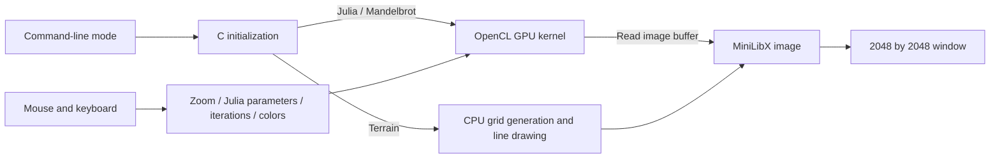

# Fractol

This project was completed as part of the École 42 / School 21 curriculum.

A C graphics project with OpenCL Julia/Mandelbrot rendering and a separate CPU procedural-terrain mode.

## Goal

Explore iterative complex-plane mathematics and interactive graphics using
MiniLibX and OpenCL. The existing [project subject](docs/subject.pdf) has been
migrated unchanged; [provenance and checksum](docs/subject-source.md) document
the evidence and uncertainties. No grade or measured acceleration is claimed.

## Requirements

### Software

- macOS with a C compiler, Make, and OpenGL, AppKit and OpenCL frameworks.
- The supplied MiniLibX/X11 libraries are Intel `x86_64` binaries. The
  `includes/X11` symlink points into `../fdf/includes/X11`, so retain that tree
  when checking out this subproject. Native Apple Silicon linkage is not
  supported by those supplied libraries.
- An XQuartz-compatible X11 runtime providing `/opt/X11/lib/libX11.6.dylib`
  and `libXext.6.dylib`, plus a graphical session.
- Julia and Mandelbrot require an OpenCL **GPU** device and support for the
  double-precision types used in both kernels; device compatibility is not
  validated. There is no CPU fallback for these modes.

### Build

From the repository root:

```sh
cd fractol
make fclean
make CC='cc -arch x86_64'
```

A clean Intel-target build was verified on an Apple Silicon macOS host using
Apple Clang. Compilation succeeds; graphical execution remains blocked by
missing X11 runtime libraries in the verification environment. On a matching
Intel setup, `make` is the normal build command. A native ARM `make` reaches
linking but fails on the supplied Intel libraries.

The Makefiles now use `CC` consistently and include the supplied MiniLibX
header directory during compilation. These are build-path/architecture
selection changes; the rendering algorithms are unchanged. `libft.a` and the
main executable were removed from version control only after source rebuilds
succeeded. `liba.a`, `libft/libft/a.out` and vendored graphics libraries remain:
no complete Makefile regeneration path was established for these artifacts.

### Running

Run from `fractol/`, because kernel files are opened relative to the current
working directory:

```sh
./fractol -m          # Mandelbrot
./fractol -j          # Julia
./fractol -t 17 10    # Procedural terrain: scale and positive height-range argument
```

The terrain command is a source-derived example, not a verified GUI result.
The argument named `seed` is used in random-height calculations; the code does
not call `srand`, so it does not select a random-generator seed.

### Testing

```sh
make -B -C libft/libft
make fclean
make CC='cc -arch x86_64'
clang -x cl -cl-std=CL1.2 -fsyntax-only mandel.cl
clang -x cl -cl-std=CL1.2 -fsyntax-only julia.cl
```

There is no repository test suite for Fractol. Kernel syntax checks do not
validate device support, memory safety, or rendered output. Actual outcomes
and blockers are recorded in [docs/VALIDATION.md](docs/VALIDATION.md).

## Implementation

### Architecture



`main.c` selects the mode, creates the window and registers callbacks.
`opencl.c` obtains the first platform and GPU device, compiles a kernel at
runtime, dispatches work and reads the image back for MiniLibX display.
`mandel.cl` starts with z = 0 and varies c by pixel; `julia.cl` varies the
initial z and uses a shared c. Both iterate z² + c until squared magnitude
reaches 4 or the iteration limit is reached.

`stash.c` initializes the view at real -4, imaginary -1, scale 300, 500
iterations and color multiplier 256. Julia starts with c = 0 + 0.8i.
`terrain*.c` uses square/diamond-style height operations, smoothing, coordinate
projection and CPU line drawing. This is a separate procedural terrain mode,
not an alternative CPU implementation of the OpenCL fractals. The executable
still links OpenCL even when terrain is selected.

### Controls

The following mappings come from `buttons.c`; numeric codes are retained
because MiniLibX keyboard conventions differ across platforms.

| Input | Code | Effect |
| --- | --- | --- |
| Escape | 53 | Exit (status 1) |
| Wheel up/down | Mouse 4 / 5 | Cursor-centered zoom ×1.5 / ÷1.5 |
| Plus/equal key | 24 | Add 50 iterations |
| Minus key | 27 | Subtract 50 iterations, without a lower bound |
| J | 38 | Toggle Julia parameter tracking; initially disabled |
| Mouse motion | Motion hook | When enabled in Julia, set c to x/2048 + i·y/2048 |
| C | 8 | Add 20,000 to the color multiplier |
| R | 15 | Subtract 20,000 when the multiplier exceeds 20,000 |

There are no explicit pan/arrow/drag handlers. Cursor-centered zoom changes
viewport offsets. Terrain registers only the keyboard hook, where Escape is
the active action; other controls apply to Julia/Mandelbrot.

### Attribution and dependencies

The original [author file](author) and source headers identify `bturcott`;
they are preserved. Git history touching this directory also records Мак and
Berta Turcotte. No mapping between `bturcott` and DWhistle/Andrey is established.
Individual/team status and individual contributions are not documented in the
original repository. Vendored dependency source, notices and author files
remain intact; the provenance/rebuild recipe for the historical MiniLibX
binaries still needs clarification.

## Conclusions

The project represents C event handling, complex arithmetic and host/GPU
coordination. It has not been validated as a complete or safe graphical
application on the current environment. In particular:

- **OpenCL dispatch has a known bounds defect:** `calculate_opencl` uses the
  image byte count as the work-item count; kernels write `array[a]` without a
  bounds guard. This launches four times the pixel count where `sizeof(int)`
  is four. Correct the launch count before attempting GPU rendering.
- Both kernels use `double`/`double8`; support is device-dependent and no
  portability fallback is implemented. Window dimensions are duplicated as
  hard-coded 2048 values in the kernels.
- Iteration count and zoom are unbounded; finite precision limits deep zoom.
  Color arithmetic is a simple multiplier, with no documented palette bounds.
- Missing kernel files are not checked before file operations; OpenCL failures
  mostly exit without useful build diagnostics. Resource cleanup and allocation
  failure handling are incomplete.
- Terrain validates positivity but does not comprehensively validate grid
  dimensions or allocation size. No terrain correctness benchmark exists.

No screenshot, successful GUI session, GPU speedup or performance number is
claimed. Follow-up work should fix the launch bounds, restore a compatible
X11/GPU environment, then test Julia/Mandelbrot and terrain separately before
recording screenshots or timings.

## Topics Studied

- C structures, pointers and resource management
- Complex-plane mathematics and iterative escape-time methods
- Mandelbrot and Julia sets
- OpenCL kernels, GPU dispatch and image-buffer readback
- Pixel coloring and graphical event callbacks
- Cursor-centered zoom and Julia parameter interaction
- Procedural terrain, coordinate projection and line drawing
- Makefiles and platform/architecture dependencies
